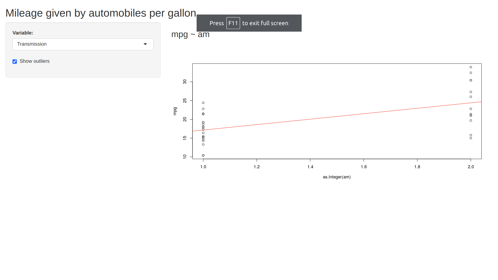
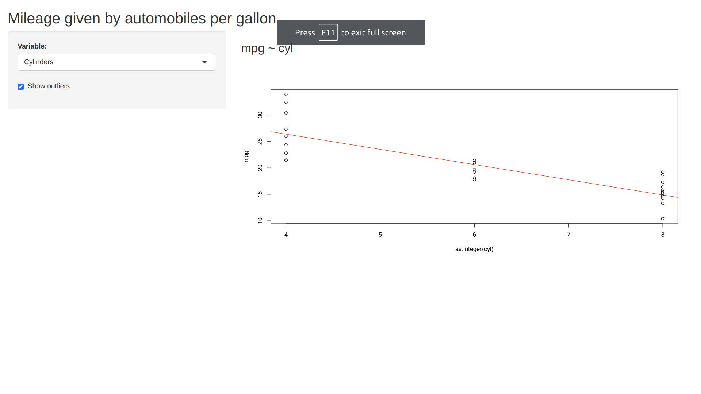

## Introduction

It is something of great impoetance. No work done such. Great work.

To be don via S happitation made using RStudio.

The Shiny application pitched by this presentation is at 
https://mehularora.shinyapps.io/shiny/

The Shiny app source code is available at https://github.com/mehular0ra/week4_changed_shiny_code
** to be changed **
** changes done **

## Application Overview

// been there in plication in Shiny in an dghkbhfgbe R hostiligy
// The source code consists of two files: server.R and ui.R
// server.R has some abosute logic which is not for user as he may find it clutter if he is not a programmer
// ui.R has some really good stuff the user which he can direcly apprieciate but is incomplete without the server so yeah somewhat youseful
// You can find the papplication on internet

## How it works? - I | The Application contains: Left Panel

- giving the name to charles babbage
- what is the size and shape of the given input figure
- what is best to the work associatedd
- great work in makiing the requeried changes
- just some more and you are done, common just a few left good
- only a few things left

## How it works? - II | The Application contains: Main Panel

There are two tabs in main panel as below:

- floppify: greately appreciated by data scientista
- fable: greately apprecited by sql programmers

## Ready to give it a try?

the app can again be viewed from 
https://halici.shinyapps.io/Gapminder-Data-Visualization-using-Shiny-and-Plotly/ 

fi you again want to see the code just go here 
https://github.com/mehular0ra/week4_changed_shiny_code

